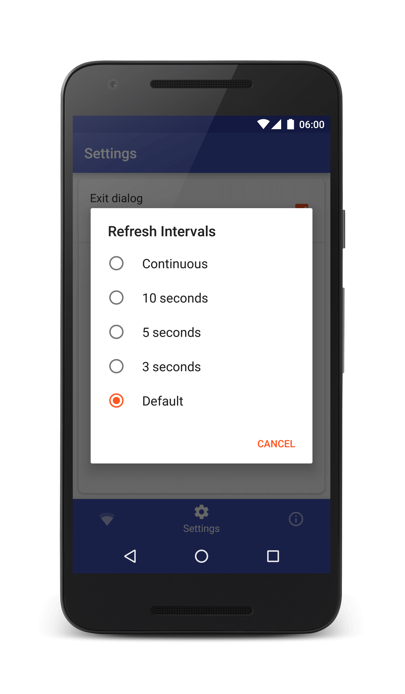
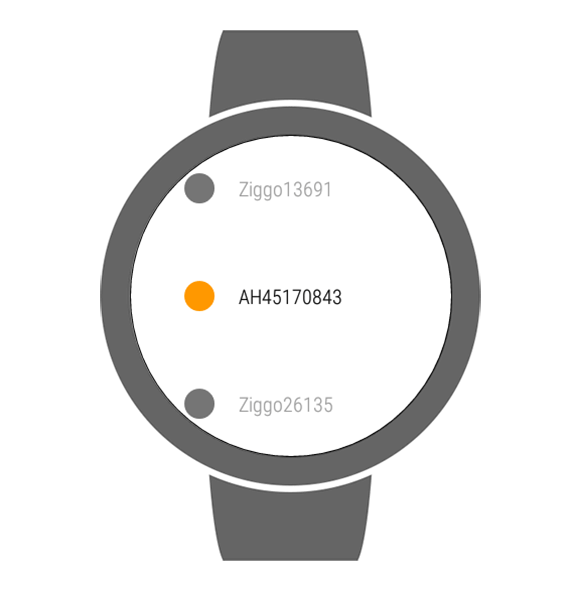
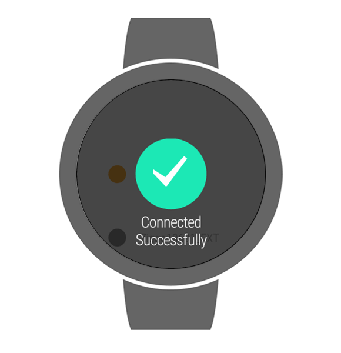

# Wear WifiSwitcher
## Summary
This repository contains both the phone and watch variants of the application.  

The phone application contains a nice overview of the network you are currently connected to.
This shows information like SSID, MAC address, IP address and signal strength.

Connection Info                                                             |  Interval Options
:--------------------------------------------------------------------------:|:---------------------------------------------------------------------:
  |  

The wear application contains functionality for switching Wifi networks on your phone via your watch.  
When opening the application it searches for the current wifi networks nearby.  
You'll get a message corresponding to the status when selecting a network to connect to.  

Watch Networks                                                        |  Connection Succeeded
:------------------------------------------------------------------- :|:----------------------------------------------------------------------:
  |  

## Running the application(s)
To run this app you can clone the repository and open the project in Android Studio.  
When selecting the run option you have the choice between the mobile and wear variant which you can 
run both on an emulator as well as on a physical device.  

The application can be found on the play store via the following link:
https://play.google.com/store/apps/details?id=nl.vosdevelopment.wearwifiswitcher.

## Questions or comments
You can shoot me an email on info@vosdevelopment.nl if you have any questions or comments you want 
to discuss privately.
